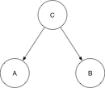

# Garbage collector in ruby, why should I care!


+++

# Aboobacker MK

Software Engineer @ Redpanthers

@tachyons in github
@_tachyons in twitter

---

Last minute backup talk

---

# Let's Talk about memmory

---

Stack: for static memory allocation

Heap: Dynamic memory allocation

---

# Ruby stores everything in heap

** Except fibres
---

# Every thing is an object

---

# Objects everywhere

---

# We have to clean it
---

Grabage collector
---


```ruby
a = "foo"
b = "bar"
c = { a => b }
```


---
Collect all unused objects
---
# History
---
Mark and Sweep (Ruby 1.8)

* Mark all living objects
* Remove unmakrked objects 


---
Simple, But causes parogram pause
---
Lazy sweep (1.9)
---

Bitmap marking (Ruby 2.0)

* Copy on write optimisation

---

# Generational GC

* Yound and old
* Addresses throughput issue
* Most objects die young

---

Incremental GC

* Intereleave GC process and Ruby process
* Shorter individual pause
* consistent perfomenece

---
* white object: Not marked object
* Grey object: Marked, but may have reference to white objects
* Marked, but no reference

---
# Object retention
```ruby
100_000.times do
  foo = "a string"
end
```

```ruby
RETAINED = []
100_000.times do
  RETAINED << "a string"
end

```
---

# Diffrence with python GC

* Ruby uses free list
* Python asks for memory
* Reference count inside objects
* reset reference to 0 when no longer in use

---
# Defragmentation

---
# Slow?

---

Thanks

+++

