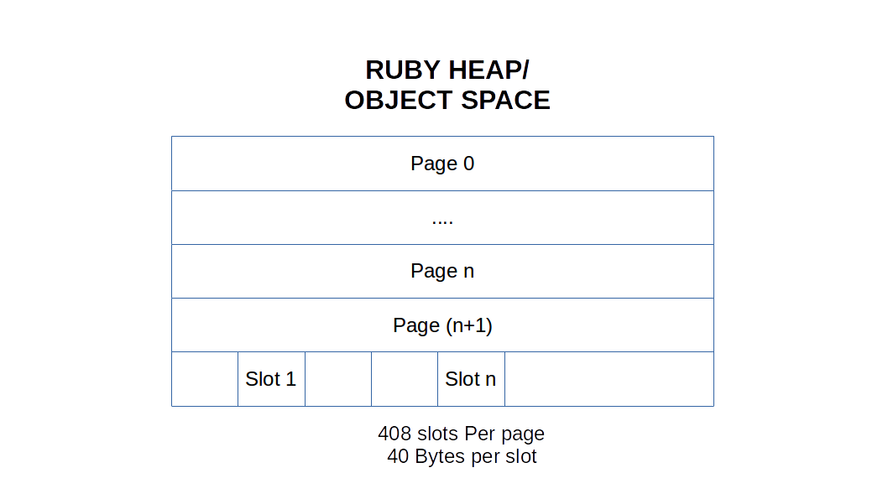

# Garbage collector in ruby, why should I care!


---?image=assets/bg.jpg

# Ugly Indian Initiative

+++


+++


---
# Garbage In ruby ?
---

# Aboobacker MK

Software Engineer @ Redpanthers

@tachyons in GitHub
@_tachyons in twitter

---
## Redpanthers

### We love conferences

Group photo here

---
# GC in a language designed for happiness
---

# Let's Talk about memory

+++


Source : https://commons.wikimedia.org/wiki/File:RAM_module_SDRAM_1GiB.jpg

---

Stack: for static memory allocation

Heap: Dynamic memory allocation

+++


---

# Ruby stores everything in heap

** Except fibers
---

# Every thing is an object

---

# Objects everywhere

---

# We have to clean it
---

#Garbage collector

* Also responsible Object allocation(Garbage creation)
* Allocate in empty slots 
* Allocate new page when empty slots aren't available

---
# Object Allocation
---


```ruby
a = "foo"
b = "bar"
c = { a => b }
c = nil
```

@[1-3]
@[4](Resetting value c to nil)


---
```ruby
a = [
  {c: 'd'}
]
```


---
Collect all unused objects
---
# History
---
Mark and Sweep (Ruby 1.8)

* Mark all living objects
* Remove unmarked objects 

---
```ruby
module GC
  def self.run
    mark
    sweep
  end

  def self.mark
    root_objects.each do |root_obj|
      root_obj.associated_objects.each do |object|
        obj.update(marked: true)
      end
    end
  end

  def self.sweep
    objects.where(marked: false).destroy_all
    objects.update_all(marked: false)
  end
end
```

@[2-5](Mark and Sweep!)
@[7-13] (Mark all living objects)
@[15-18] (Sweep all unmarked objects)
---


---
Simple, But causes program pause

> https://xkcd.com/303/
---
#Lazy sweep (1.9)

* Reduce the stoping the world |
* 8% faster in average |

---

Bitmap marking (Ruby 2.0)

* Copy on write optimization

+++

# Copy on Write
- Process and threads for independent execution
- Processes have own memory space |
- Threads share memory in the parent process |
- Copy on write is an os feature which enables sharing of space between child processes till they are modified by one of the process

+++

- Ruby couldn't take advantage of this since we where changing objects for marking
- Bitmap marking take care of this by keeping marks out of the object | 
- Introduced by Narihiro Nakamura |


---

# Generational GC

- Young generation and old generation |
- Major and Minor GC |
- Address throughput issue |
- Most objects die young |

---

Incremental GC

- Interleave GC process and Ruby process
- Shorter individual pause | 
- consistent perfomance |

---
* white object: Not marked object
* Grey object: Marked, but may have reference to white objects
* Black Marked, but no reference

---

```ruby
module GC
  def self.run
    objects.update_all(color: white)
    clearly_living_objects.update_all(color: grey)
    objects.where(color: grey).each do |object|
      object.references.update_all(color: grey)
      object.update(color: black)
    end
    objects.where(color: white).destroy_all
  end
end
```

@[3](Mark all objects as white )
@[4](Make all clearly living objects as grey)
@[5-8](Pick one grey object, visit each object it references and color it grey. Change the color of the original object to black. Repeat until there are no grey objects left only black and white)
@[9](Collect white objects as all living objects colored black)

---
# Compaction GC
- Work in progress
- Remove heap fragmentation by aligning objects together | 
- By Aaron Patterson |

---

# Other changes
* Parallel marking
* Symbol GC(2.2)
---
# TIPS
---

## Can ~~money~~ sacrificing perfomance buy happiness?

---
> Programmers waste enormous amounts of time thinking about, or worrying about, the speed of noncritical parts of their programs, and these attempts at efficiency actually have a strong negative impact when debugging and maintenance are considered. 

> We should forget about small efficiencies, say about 97% of the time: premature optimization is the root of all evil. Yet we should not pass up our opportunities in that critical 3%. Donald Knuth

---
- Prefer symbol over string for hash key |
- Do not try to retain objects in the memory unless necessary |
- Use frozen string literal feature for ruby 2.3 and above |
- Use jmalloc over glibc |
- Tune GC parameters (Only if you know what you are doing) |
- Limit strings less than 23 characters when possible | 
- Offload operations to database | 
- Do not depend on enumerables when data is too big | 
- Always update to latest ruby version |
---

#TOOLS
- Rack mini profiler
- Derailed Benchmarks |
- Heapy |
- ruby-prof |

---

Conclusion

- Ruby uses GC so that you don't have to manually allocate and free objects
- Object retention increases memory use |
- Object creation even if temporary can be a performance problem, can also increase memory |
- Understanding GC helps you when you want to tune your application | 

---

Thanks

---

